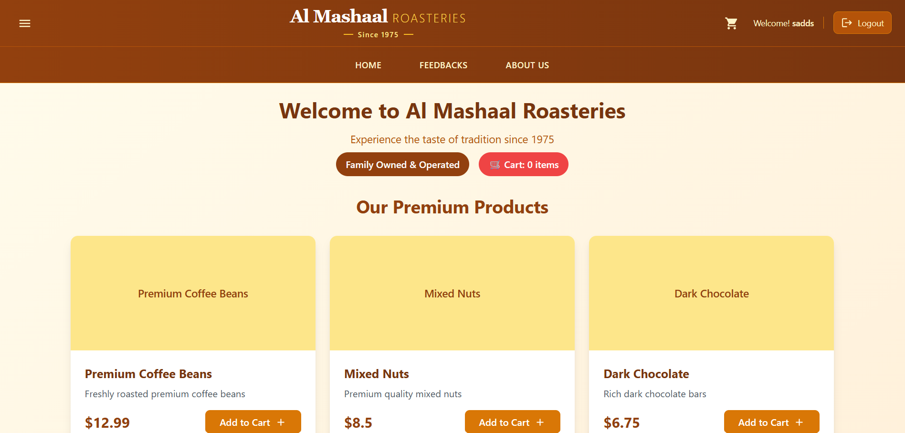
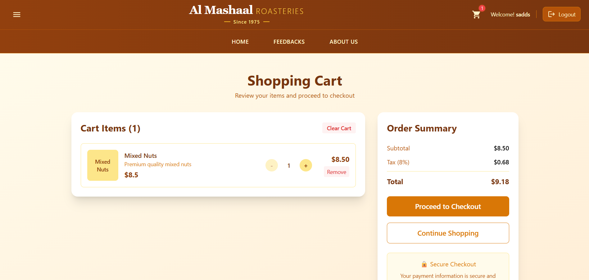
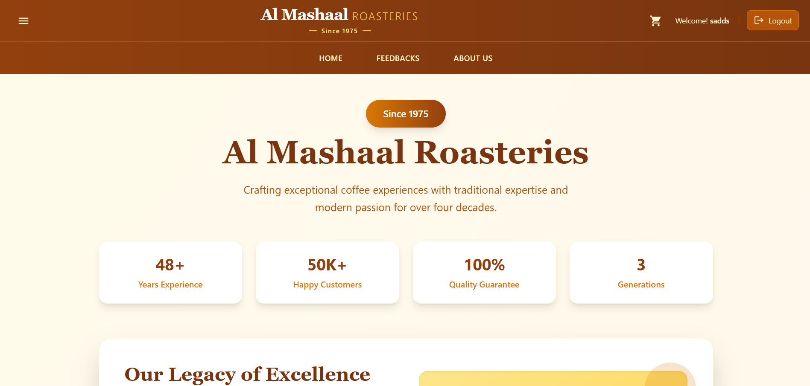
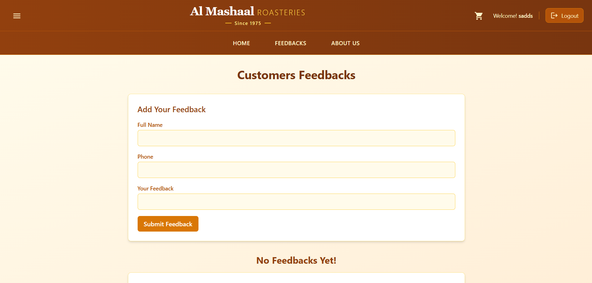
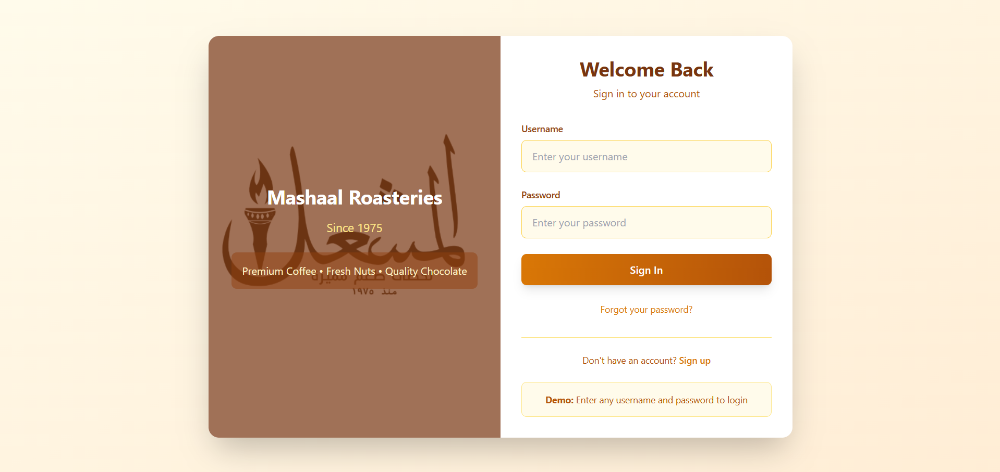

# Al Mashaal Roasteries - E-Commerce Web Application


A modern e-commerce web application for Al Mashaal Roasteries, a traditional coffee and nuts business established in 1975. Built with React.js and Tailwind CSS.


## 📸 Screenshots

### Home Page


### Shopping Cart


### About Us


### Customer Feedback

### Customer Login


## ✨ Features

- **🛍️ Product Catalog** - Browse premium coffee and nuts products
- **🛒 Shopping Cart** - Add, remove, and manage cart items
- **🔐 User Authentication** - Login and registration system
- **📱 Responsive Design** - Works on desktop, tablet, and mobile
- **💬 Feedback System** - Customer feedback collection and display
- **📦 Order Processing** - Complete checkout with order tracking
- **🎨 Modern UI/UX** - Professional design with smooth animations

## 🛠️ Technologies Used

- **Frontend Framework:** React.js 18
- **Styling:** Tailwind CSS
- **Routing:** React Router DOM
- **Icons:** Material-UI Icons
- **State Management:** React Hooks + localStorage
- **Build Tool:** Create React App

## 📋 Prerequisites

- Node.js (version 14 or higher)
- npm or yarn package manager

## 🚀 Installation & Setup

```bash
# Clone the repository
git clone https://github.com/Zakariaziadeh/part1.git
cd part1

# Install dependencies
npm install

# Start development server
npm start

# Build for production
npm run build
